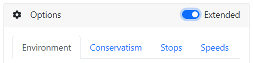

# Application help

## Supported platforms

This application works in Edge, Chrome, Safari and doesnt work in Firefox and Opera. Currently you can use it offline mode using "Add to home screen" in Edge or Chrome browsers. On mobile devices this feature works only on Android.

## Theoretical model

* All calculations are done in metric units (and than converted to imperial units when requested)
* Internally `Bühlmanns ZHL-16C` algorithm without any modification and with gradient factors is implemented.

## Limitations

For some calculations it is necessary to measure precise values. Earths physical model is simulated, but not to all details. Together with different rounding during the calculations, this is why diving software implementations differ and mainly also why some simplifications was used during your scuba diving courses.
For example we count with sea level atmospheric pressure 1.01325 bar, but usually everybody counts with 1 bar only, which makes 1.325% deviation. We use such simplifications on some screens and you are warned about it. Similar results you see in this application you should see in other applications or dive computers.
Also keep in mind the value provided are only valid, if verified. E.g. there were only few divers bellow 150 m and it means, that there was not enough research done, if the Bühlmann formula works at these depths. The same applies to small depths, where the no decompression limit easily reaches saturation diving. 

> Check, if there is warning about depth conversion simplification.

> We recommend to use Bühlmann algorithm with heavy decompression only in range 10 - 150 m (30 - 500 ft).

> Don`t use the calculated decompression for saturaion diving!

## Screen structure

To be able calculate dive profile you need to enter Gases used during the dive, depth and calculation options, each of these is placed within its own box. Every time you change any option new profile is calculated. We distinguish two kind of views.

* `Simple`: For simple dives, faster to get results. Only one target depth and time with only one tank is available. Some options aren't visible and are simplified (e.g. you are unable to set precise gradient factors). If it is not enough use Extended view.
* `Extended (Trimix)`: Allows you define unlimited number of tanks and depth levels. You are free to customize details of the profile calculations. Switch back to simple resets some values, mainly depth levels and gases.

