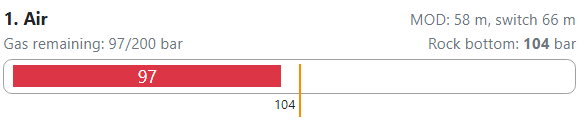

# Consumed gas charts

* `Gas remaining`: The consumed gas is extracted from tank Start pressure. Example shows not enough gas to realize the dive. Only 97 bars (1407 psi) are remaining from 200 bars (2900 psi). But the reserve is 104 bars (2030 psi), which should be still present in the tank after you reach the surface from dive without any issue.
* `Rock bottom` [bars] (psi): Minimum amount of gas (reserve) required for safe ascent in case of emergency for two divers under stress. It is shown for each defined tank. These values are calculated at "Rock bottom at" time.

> If diver defines 20 Liters/minute his RMV, than the Rock bottom counts with 60 liters/minute breathing rate for both divers during emergency ascent.

How reserve is calculated? Currently only all usable strategy is implemented.

1. Simple view: Ascent is automatically calculated from deepest point at end of the planned time. In this case the rock bottom is gas needed for proper ascent to the surface.
2. Complex multilevel dive with or without user defined parts of the profile up to the surface. Again we use all available tanks even they aren't used by user. Emergency ascent is calculated at end of deepest point, since rest of the profile is considered as decompression ascent.

In case of multiple tanks

* Consumed gas is extracted in reverse order from last tank up to the first tank
* Reserve for first tak remains always at least 30 bars (435 psi)
* For all other tanks, there is no reserve required as technical minimum, until the reserve isn't larger than capacity of the first tank.
* In case of multiple tanks with the same bottom gas, to consume from both tanks and distribute the reserve, you need manually create segments and assing the tanks in Extended view.
