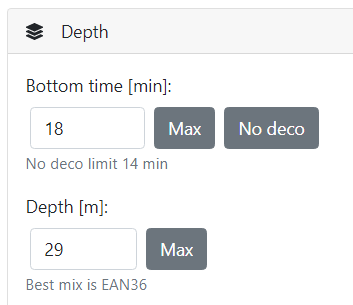

# Depth(s)

In simple view you can define only one target depth, which fits only to easy or open water profiles.
* `Bottom time` [minutes]: The time diver stays under water until he starts to scent. This includes also decent.
    * `Max`: Applies the maximum estimated bottom time to the plan
    * `No deco`: Applies the maximum no decompression limit time to the plan
* `Depth` [meters] (ft): The deepest depth reached during the dive.
    * `Max`: Based on selected options applies maxim depth based on narcotic depth selected gas (for nitrox mixes always 30 meters / 100 ft)
    * `Best mix`: Shows best content of nitrox mix for selected depth based on maximum partial pressure of oxygen (ppO2)

## Extended view

In extended view you can define more complex profile for profiles like following reef, wreck penetration or caves. 

* `From` [m]: Start depth at beginning of the waypoint. For first row it is always surface (0 m/ 0 ft).
* `To` [m]: It is target depth the diver reaches at end of the waypoint duration. It doesn't have to be the same depth as start depth. You can define whole profile up to the surface.  
* `Duration` [min]: Total duration of selected waypoint.
* `Tank`: You can select any tank defined in tanks. This does not prevent to select tank, which is not breathable at selected depth.

> When switching back to simple view, all the depths will be reset to single descent to target depth.

## Repetitive dives and Surface interval

In both views you are able to add more dives and define surface interval. You can't define surface interval for first dive.
The surface interval defined duration of break the diver takes after surfacing from previous dive to enter the water for current dive.
When diver is resting, the tissues are still releasing nitrogen or helium. So next dive after small break reduces the no decompression limit and prolongs the time to come back to the surface.
You have two options for second and next dives to set the surface interval:

* `HH:MM`: Enter the hours and minutes as duration since the previous dive. E.g. 02:45 means 2 hours and 45 minutes or 165 minutes total surface interval.
* `First dive`: Selecting this value from the dropdown sets dive as it is the first dive and there was no dive before. This is also default value for newly added dives.

> Usage of the surface interval affects all calculated values like the NDL shown in the dive results table.
 

