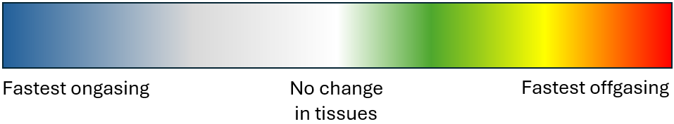
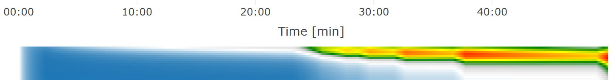

# Dive profile chart

Graphical representation how the calculated depth changes in time. This corresponds to precise values shown in the way points table. Move mouse over the chart to focus related row in the waypoints table.

* `Dive profile`: Blue line showing diver depth at each moment during the dive.
* `Ceiling`: Orange line showing minimum depth at which diver needs to stay to decompress before he continues with ascent.
* `Average depth`: Dotted line showing average depth at each moment of the dive. This is useful for consumption calculations.

Why is deco shown in the chart, if profile is still considered a no deco?
In some plans you already reach small amount of ceiling, which disappears during the ascent even without any decompression stop. So you are still free to ascent directly to the surface. These kind of dives are still considered as no decompression.

> In the chart profile, the blue line should never cross the orange line!

## Tissues heat map

> The heat map is available only when enabled by 'Flame' button in right upper corner of the chart.

This chart shows the speed of tissues ongasing or offgassing. The ratio is calculated for every tissue,
so the highest value means fastest desaturation (offgassing) reached or broken limit defined by allowed M-Value. The lowest value means maximum ongassing speed.
The ratio is shown as a heat map, tissues are ordered down from fastest to slowest tissues (fastest are upper, slowest down) and time line of the dive from left to right following the same direction as chart above.
The color scale for every ratio is shown on picture below. Red color represents the highest ratio and the blue color the lowest ratio.
How to read this chart? It may help you to understand dangerous moments during the dive, when you are close to the limit of the M-Values. The more red the worse the dive or at least its ascent part is.

Heat map scale

Example heat map

Even without showing the profile chart, we can predict, what the following heat map shows. 
* 0 minute: Beginning of the dive (left part), we can see fast change to blue, which indicates fast ongassing, the diver descends.
* 10-25 minute: There is slow change for fast tissues (upper part ot the chart) to white, 
which indicates the tissues are close to be saturated and less gas is going to the tissues (the saturation is slowing down).
* 25 minute: The diver starts ascend and performs decompression stops shown as fast changes to green, yellow up to the red.
* 25-40 minute: you can also see blue in bottom part of the chart, meaning slow tissues are still ongassing, even during ascent.
During every decompression stop, the diver stays at the same depth, so the tissues are offgassing and color slowly changes back to yellow, green and white.
* 38 minute: The worst tissues overpressure can be found, where maximum amount of red is visible for most tissues. 

