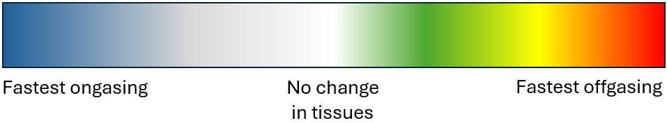
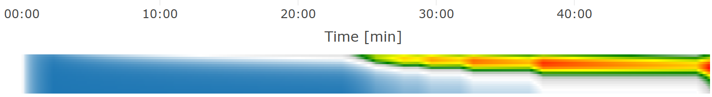

# Dive profile chart

A graphical representation of how the calculated depth changes over time. This corresponds to precise values shown in the waypoints table. Move your mouse over the chart to focus on the related row in the waypoints table.

* `Dive profile`: Blue line showing the diver's depth at each moment during the dive.
* `Ceiling`: Orange line showing the minimum depth at which the diver needs to stay to decompress before continuing with the ascent.
* `Average depth`: Dotted line showing the average depth at each moment of the dive. This is useful for consumption calculations.

Why is decompression shown in the chart if the profile is still considered a no-deco dive?
In some plans you already reach a small amount of ceiling, which disappears during the ascent even without any decompression stop. So you are still free to ascend directly to the surface. These kinds of dives are still considered as no-decompression.

> In the chart profile, the blue line should never cross the orange line!

## Tissues heat map

> The heat map is available only when enabled by 'Flame' button in right upper corner of the chart.

This chart shows the speed of tissues on-gassing or off-gassing. The ratio is calculated for every tissue, so the highest value means the fastest desaturation (off-gassing) or the reached/broken limit defined by the allowed M-Value. The lowest value means the maximum on-gassing speed.
The ratio is shown as a heat map, with tissues ordered from fastest to slowest (fastest at the top, slowest at the bottom) and the timeline of the dive from left to right, following the same direction as the chart above.
The color scale for every ratio is shown in the picture below. Red color represents the highest ratio and blue color represents the lowest ratio.
How to read this chart? It may help you understand dangerous moments during the dive when you are close to the limit of the M-Values. The more red, the worse the dive, or at least its ascent part is.

Heat map scale

Example heat map

Even without showing the profile chart, we can predict what the following heat map shows. 
* 0 minute: Beginning of the dive (left part), we can see a fast change to blue, which indicates fast on-gassing as the diver descends.
* 10-25 minute: There is a slow change for fast tissues (upper part of the chart) to white, which indicates the tissues are close to being saturated and less gas is going into the tissues (the saturation is slowing down).
* 25 minute: The diver starts to ascend and performs decompression stops shown as fast changes to green, yellow and up to red.
* 25-40 minute: You can also see blue in the bottom part of the chart, meaning slow tissues are still on-gassing even during ascent. During every decompression stop, the diver stays at the same depth, so the tissues are off-gassing and the color slowly changes back to yellow, green and white.
* 38 minute: The worst tissue overpressure can be found where the maximum amount of red is visible for most tissues. 

