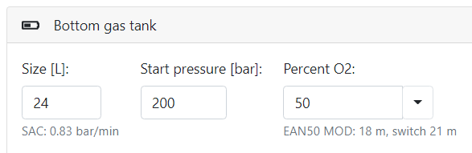

# Tanks

* `Size` [Liters] (cuft): The volume of the tank used during the dive. Size of the tank impacts how long you can stay underwater under the same conditions. See also SAC/RMV calculations.
* `Percent O2` [Percent]: Select precise value when measured or pick one of the predefined standard gases. Always provide a value rounded to the precisely measured value.
  * `MOD`: Shows maximum operational depth in meters calculated from configured maximum ppO2 (see also Nitrox calculator)
  * `Switch`: Shows maximum depth in meters at which you can switch to this gas for decompression purposes. It is calculated from configured maximum decompression ppO2
* `Start pressure` [bars] (psi): The pressure the tank is filled with the gas as read on the pressure gauge. This value is usually represented as a full tank. Keep in mind to subtract approximately 10 bars (150 psi) in cold water, since temperature will reduce the pressure immediately after you enter the water.
* `Working pressure` [psi]: Used to calculate real water volume tank size from tank size. This value is available only in imperial units.

> Why is switch always deeper than MOD? Because maximum ppO2 for deco gas is usually higher than for bottom gas.

Example: Maximum deco ppO2 is 1.6, for bottom gas the maximum ppO2 is only 1.4. For EAN50 (50% oxygen) MOD is calculated as 18 meters (60 ft) for bottom gas max ppO2, but 21 meters (70 ft) for max deco ppO2. On a real dive, you don't want to push your oxygen toxicity stress to too high a value for a long time. But when switching to decompression gas during the ascent you want to open an oxygen window at higher ppO2, but only for a short period of time, expecting that you continue ascending after the switch (See also gas switch duration option).

> To access **TRIMIX** gases switch to Extended view!

## Trimix/Helitrox

[Trimix or Helitrox](https://en.wikipedia.org/wiki/Trimix_(breathing_gas)) are gas mixtures, which add Helium as third significant component into the mixture. So the gas typically consist of oxygen, helium and nitrogen. These gases are usually expensive because of helium price. It is the reason why usually deeper dives are done nowadays using closed circuit (CCR). Our planner currently supports planning only for open circuit (OC). We distinguish all the gases by amount of oxygen.

> We recommend to choose from one of the commonly used gases and use the same gases for all team members! See [Standard gases](./standard_gases.md)

To be able to distinguish the content, we call the gases using only their oxygen and helium parts. E.g., Trimix 18/48 consists of 18% oxygen, 45% helium and the rest is nitrogen. To be able to select the correct mix, we need to know the depth range at which the gas can be used. 
The range is limited by `MOD`, `Minimum ppO2`, `Equivalent narcotic depth` (END for nitrox gases) and `Maximum narcotic depth` (MND).
We choose the lower depth from MND and MOD as the maximum depth for the gas mixture.

> Select gas using [Gas properties](./gas_properties.md) calculator

General recommendations when planning deep dives:

* We don't recommend deep dives on air!
* You should always use Trimix for depths below the maximum narcotic depth!
* Consider not switching to a gas with higher nitrogen content because of [Isobaric counter diffusion](https://en.wikipedia.org/wiki/Isobaric_counterdiffusion). We generate a warning following the 1/5 rule: Any increase in gas fraction of nitrogen in the decompression gas should be limited to 1/5 of the decrease in gas fraction of helium.
* Use a separate argon bottle for dry suit inflation. This is not calculated into the gas consumption.
* Keep in mind also [High pressure nervous syndrome](https://en.wikipedia.org/wiki/High-pressure_nervous_syndrome) (HPNS)
* Because of high amount of oxygen consumed during deep dives, watch your [Oxygen toxicity](https://en.wikipedia.org/wiki/Oxygen_toxicity#Underwater) (CNS/OTU)
