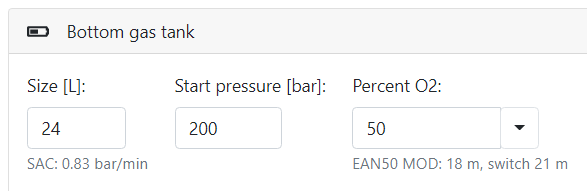
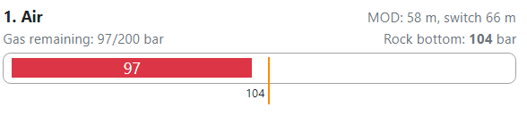

# Help

## Calculations Background

For some calculations it is necessary to measure precise values. Earths physical model is simulated, but not to all details. In such cases some constants are used. Together with different rounding during the calculations, this is why diving software implementations differ and mainly also why some simplifications was used during your scuba diving courses. For example we count with sea level atmospheric pressure 1.01325 bar, but usually everybody counts with 1 bar only, which makes 1.325% deviation. We use such simplifications only in Nitrox calculator. Similar results you see in this application you should see in other applications or dive computers.

## Theoretical model

* All calculations are done in metric units (and than converted to imperial units when requested)
* Internally `Bühlmanns ZHL-16C` algorithm with gradient factors is implemented.

## Screen structure

To be able calculate dive profile you need to enter Gases used during the dive, depth and calculation options, each of these is placed within its own box. Every time you change any option new profile is calculated. We distinguish two kind of views.


* `Simple`: For simple dives, faster to get results. Only one target depth and time with only one tank is available. Some options aren't visible and are simplified (e.g. you are unable to set precise gradient factors). If it is not enough use Extended view.
* `Extended`: Allows you define unlimited number of tanks and depth levels. You are free to customize details of the profile calculations. Switch back to simple resets some values, mainly depth levels and gases.

### Depth


* `Bottom time` [minutes]: The time diver stays under water until he starts to scent. This includes also decent.
  * `Max`: Applies the maximum estimated bottom time to the plan
  * `No deco`: Applies the maximum no decompression limit time to the plan
* `Depth` [meters]: The deepest depth reached during the dive.
  * `Max`: Based on selected options applies maxim depth based on narcotic depth selected gas (for nitrox mixes always 30 meters)
  * `Best mix`: Shows best content of nitrox mix for selected depth based on maximum partial pressure of oxygen (ppO2)

### Tanks

* `Size` [Liters]: The volume of the tank used during the dive. Size of the tank impacts how long you can stay under water under the same conditions. See also SAC/RMV calculations.
* `Percent O2` [Percents]: Select precise value when measured or pickup one of predefined standard gases. Always provide value rounded up the precisely measured value.
  * `MOD`: Shows maximum operational depth in meters calculated from configured maximum ppO2 (see also Nitrox calculator)
  * `Switch`: Shows maximum depth in meters at which you can switch to this gas for decompression purposes. It is calculated from configured maximum decompression ppO2
* `Start pressure` [bars]: The pressure the tanks is filled in with the gas as red on the pressure gauge. This value is usually represented as full tank. Keep in mind to subtract cca 10 bars in colds water, since temperature will reduce the pressure immediately after you enter the water.



> Why is switch always deeper than MOD? Because maximum ppO2 for deco gas is usually higher than for bottom gas.

Example: Maxim deco ppO2 is 1.6, for bottom gas is maximum ppO2 only 1.4. For Ean50 (50 % oxygen) MOD is calculated as 18 meters for bottom gas max. ppO2, but 22 meters for max. deco ppO2. On real dive, you don't want to push your oxygen toxicity stress to high value for long time. But when switching to decompression gas during the ascent you want to open oxygen window at higher ppO2, but only for short period of time, expecting that you continue ascending after the switch (See also gas switch duration option).

> To access **TRIMIX** gases switch to Extended view!

### Trimix/Helitrox

[Trimix or Helitrox](https://en.wikipedia.org/wiki/Trimix_(breathing_gas)) are gas mixtures, which add Helium as third significant component into the mixture. So the gas typically consist of oxygen, helium and nitrogen.  These gases are usually expensive because of helium price. It is the reason why usually deeper dives are done nowadays using closed circuit (CCR). Our planner currently supports planning only for open circuit (OC). We distinguish all the gases by amount of oxygen. Because you can choose from lot of combinations, we provide list of common gases. Some agencies (GUE, UTD) limit their mixes to list called Standard gases (see e.g. [GUE standard gases](https://gue.com/blog/standard-gases-the-advantages-of-having-everyone-singing-the-same-song/)).

| Category | Oxygen content | Example |
| --- | --- | --- |
| Hypoxic | < 18 % | Trimix 18/45 |
| Normooxic | 18 - 21 % | Air |
| Hyperoxic | > 21 % | EAN50 |

To be able distinguish the content we call the gases using only is oxygen and helium parts. E.g. Trimix 18/48 consists of 18 % oxygen, 45% of helium and the rest is nitrogen. Even you are able to define your custom mixture, because of practical reasons it is preferred to use the same gases within the team over custom gases or different gases for each diver.

> We recommend to choose from one of the commonly used gases and use the same gases for all team members!

TODO

* Depth range of selected gas
* Don't switch to gas with higher nitrogen content
* Use separate argon bottle for drysuit inflation. This is not calculated in to the gases consumption
* Equivalent narcotic depth, equivalent air depth
* Equivalent narcotic depth for nitrox is always the same as air (counting oxygen as toxic). The only way how to reduce is by adding helium, i.e. use trimix instead of nitrox.
* HPNS <https://en.wikipedia.org/wiki/High-pressure_nervous_syndrome>
* Don't switch to gas with higher content of Nitrox warning - <https://en.wikipedia.org/wiki/Isobaric_counterdiffusion>
* [Oxygen toxicity](https://en.wikipedia.org/wiki/Oxygen_toxicity#Underwater) (CNS/OTU)
* See also Options - Gases to define maximum narcotic depth and oxygen toxicity


> You should always use Trimix for depths bellow maximum narcotic depth!

#### Decompression gas selection

TODO

* Why we don't recommend to select gas with higher nitrogen content? <https://en.wikipedia.org/wiki/Isobaric_counterdiffusion>
* Why we always select gas with higher oxygen content?

## Options

For faster customization or to be able reset options to default values, you can use two buttons.

* `Recreational`: Options taught in basic open water courses for most training agencies. This will switch e.g. safety stop to 5 meters and ascent speeds to 9 meters/minute.
* `Recommended`: We strongly encourage you to use these values instead of recreational values, because we thing they are safer and they are the default values for this application. This sets e.g. slower ascent closer to surface.

### Environment

* `Salinity`: Because salinity of water changes its density and it means also pressure of the water column at depth. In result it affects the tissues loading. See also wiki for [brine](https://en.wikipedia.org/wiki/Brine). Eg. 22 meters corresponds to 3.222 bar in salt water. You can choose from fresh water, salt (sea) water and Brackish (EN13319) water. Brackish water is somewhere between salt and fresh. It is used by some computers as the only one option (Suunto). In case your dive computer doesn't contain Brackish water use salt water (value with higher content of salt).

| Salinity | Location | Salinity [gram/liter] | Density [kg/m3] |
| --- | --- | --- | --- |
| Salt | Red sea, Mediterranean sea | 38 | 1028 |
| Brackish (EN13319) | Black sea, Baltic sea | 28 | 1020 |
| Fresh | Lakes | 0.1 | 1000 |

* `Altitude`: Similar effect on decompression like salinity has diving at higher altitude. The higher you are, the lower is the atmospheric pressure around you. 0 m.a.s.l. means sea level, e.g. 1.0132 bar. Diving at higher altitude results in higher decompression (e.g. shorten no decompression limit).

| Altitude [m.a.s.l.] | Air pressure [bar] |
| --- | --- |
| 0 | 1.01 |
| 400 | 0.97 |
| 700 | 0.93 |
| 2000 | 0.79 |

### Conservatism - Gradient Factors

This is the key options which defines the generated profile curve. For more details about this option see [Gradient factors article](https://www.diverite.com/articles/gradient-factors/) by Dive rite.
You can use predefined group of values, which correspond with values used by Shearwater dive computers. Both values are in range 10-100 %. Where 100 % means pure Bühlmann with no gradient factors. Today it is generally considered as not safe enough. The lower the value is, the more safety you get by reducing allowed maximum tissue pressure (supersaturation level). But the price is longer ascent. So the correct behavior is to find sme compromise. Here is simple explanation how it works.

* `Gradient factor Low` (GF Low): Is applied on depths range. It defines moment at which we first time reach the maximum supersaturation level. I.e. it defines depth of first stop. Low value means the first stop will be at higher depth. More about deep stops in [this article](https://thetheoreticaldiver.org/wordpress/index.php/2019/06/16/short-comment-on-doolettes-gradient-factors-in-a-post-deep-stops-world/)

* `Gradient factor High` (GF High): Is applied on tissue supersaturation level. The higher value you define, the higher allowed pressure in body tissues you allow when surfacing. The moment at which you surface is defined by duration of last stop, which this value controls. The higher value you define, the shorter will be the last stop duration.

Following chart shows how different gradient factors apply to ascent profile. Legend shows gradients as GFLow/GFHigh. As you can see gf Low 20 % starts stops deeper, than GF Low 40 %. Similar GF High 70 % means longer stop at 3 meters than GF High 90 %, in which case you reach the surfaces faster. 100/100 means pure Bühlmann, with no additional safety margin.


Which values to apply? Here are recommended values explained:

| Gradient factors | Recommendation |
| --- | --- |
| Low (45/95) | Shallow dive, good conditions, fit and healthy diver |
| Medium (40/85) | Repetitive dive, average conditions |
| High (30/75) | Deep dives, decompression dives, hard conditions |

### Gases

* `Maximum narcotic depth` [m]: Limits, at which depth gas mixture is considered to be narcotic. Exceeding this depth means the risk of narcosis significantly increases. Default value is 30 meters. Increasing this values allows you to use also nitrox mixes to higher depth, which is not recommended. See also [Equivalent narcotic depth](https://en.wikipedia.org/wiki/Equivalent_narcotic_depth)
* `Is oxygen narcotic`: If enabled (default), counts also oxygen as narcotic gas, otherwise only nitrogen is considered to be narcotic. Most agencies count both oxygen and nitrogen as narcotic gases. Disabling this option allows to you to use gases deeper, but is less safer.

### Stops

* `Problem solving duration` [min]: Usually 1-2 minutes added to the bottom time to solve issues causing emergency ascent. This value is used only for Rock bottom calculation.
* `Gas switch duration` [min]: Usually 1-3 minutes added as stop for gas switch. During this time the body has time to start consume less nitrogen under high pressure causing higher volume of nitrogen to be released from tissues and start [oxygen window](https://en.wikipedia.org/wiki/Oxygen_window).
* `Round deco stops to minutes`: By default stops are calculated in seconds. In case you wan't them rounded up to minutes, enable this options. This affects only stops duration not ascent between stops.
* `Last stop depth` [m]: Allows 3-6 meters, depending on conditions. Most agencies train to do 3 minutes stop at 5 meters, which doesn't have to be precise enough for more complex dives. E.g. In higher waves you want the stop at deeper depth. At the other hand some dive site conditions require you to do the stop close to the surface at 3 m depth.
* `Add 3 min safety stop`: You can choose when the algorithm adds additional 3 minutes to last decompression stop. The safety stop is always added to the last stop duration (if any) at depth of defined last stop (see above).
  * `Never`: The safety stop is not added, the last stop is only controlled by decompression
  * `Auto (> 10m)`: The safety stop is added only in case the planned depth is deeper than 10 meters. This option is default and is suitable for recreational divers.
  * `Always` : Even you train in shallow pool without decompression stops, you may want to add the safety stop as additional safety margin. This enforces the safety stop at end of the ascent

> Configuration of safety stop always applies also to rock bottom calculation in case of emergency ascent.
> When the algorithm allows ascent to next decompression or safety stop? Currently the easiest solution is implemented (not optimal). You wait at the stop, until the ceiling is shallower than next stop. Than you can start ascent to next stop.

### Speeds

* `Descent speed` [m/min]: Used in case user defines target depth only. In such case this value is used to calculate the descent.
* `Ascent up to 50% depth` [m/min]: Is speed used to calculate ascent from target depth up to 50% of average depth.
* `Ascent up to 6 m depth` [m/min]: Is speed used to calculate ascent from 50% average depth up to 6 m.
* `Ascent 6 m to surface` [m/min]: Is speed used to calculate ascent from 6 m up to the surface.

> All the ascent speeds are used for both planned ascent and emergency ascent used to calculate the rock bottom.

All the speeds are used also in user defined ascents or descents by checking, if the plan is within the speeds range.
Change of ascent speeds apply at 3 m intervals, the same applies to decompression stops. It is recommended to use lower values closer to the surface. Use Recommended button to apply default values 9, 6 and 3 meters/min. For recreational dives used by most agencies, all are set to 9 meters/min.

Following table shows example dive to 30 meters with average depth 28.6 meters and recommended speeds at moment the diver starts ascent. 50 % of average depth is rounded to 12 meters.

| Depth range [m] | Ascent speed [m/min] |
| --- | --- |
| 30 - 12 m | 9 |
| 12 - 6 | 6 |
| 6 - 0 | 3 |

## Calculated results (Dive info)

* `Time to surface (TTS)` [minutes]: Total duration of ascent from critical point of dive in case of emergency. Problem solving duration minutes are added to ascent duration to be able respond to situation at depth as recommended during scuba trainings.
* `No decompression time` [minutes]: The longes time diver can stay at required depth where direct ascent to the surface is considered to be safe.
* `Maximum bottom time` [minutes]: The longest time diver can stay at required depth considering provided gases
* `Rock bottom at` time: The moment at which the emergency ascent is calculated used to calculate the rock bottom. It is the last moment at highest depth.

> **Emergency ascent may differ from calculated ascent**, because it is calculated at different time during the dive.

### Events causing errors and warnings

In case of any issue with the plan, Notification messages are shown bellow the dive table colored by red for errors and yellow for warnings. Warning should be understood so that the dive isn't optimal and there is low risk of problems. Error means, that the plan doesn't make sense or probably will end in dead. There are also informative messages

| Event | Risk | Solution |
| --- | --- | --- |
| Not enough gas | Easy, right? | Provide more tanks, use larger tank or reduce planned depth or duration |
| High ppO2 | High content of oxygen increase risk of oxygen toxicity which may cause convulsions, drowning or dead | Use gas with lower oxygen content or reduce planned depth |
| Low ppO2 | At that point the gas is hypoxic and may cause drowning or dead | Use gas with higher oxygen content |
| High ascent speed | User defined part of the dive with high risk of micro-bubbles which cause higher risk of DCS | Enlarge the ascent duration |
| High descent speed | Higher risk of ear (or other cavities) barotrauma | Enlarge the descent duration |
| Broken ceiling | In user defined part of the dive profile you reach lower depth than current ceiling, which increases risk of DCS | Fix the profile, so always stay bellow the ceiling |

> This is the main purpose of this application: to reduce these risks!

Read more about

* [Decompression sickness](https://en.wikipedia.org/wiki/Decompression_sickness) (DCS)
* [Cavities bartrauma](https://en.wikipedia.org/wiki/Barotrauma)
* [Oxygen toxicity](https://en.wikipedia.org/wiki/Oxygen_toxicity#Underwater)
* [Hypooxia](https://en.wikipedia.org/wiki/Hypoxia_(medical))

### Consumed gas charts



* `Gas remaining`: The consumed gas is extracted from tank Start pressure. Example shows not enough gas to realize the dive. Only 97 bars are remaining from 200 bars. But the reserve is 104 bars, which should be still present in the tank after you reach the surface from dive without any issue.
* `Rock bottom` [bars]: Minimum amount of gas (reserve) required for safe ascent in case of emergency for two divers under stress. It is shown for each defined tank. These values are calculated at "Rock bottom at" time.

> If diver defines 20 Liters/minute his RMV, than the Rock bottom counts with 60 liters/minute breathing rate for both divers during emergency ascent.

How reserve is calculated? Currently only all usable strategy is implemented.

1. Simple view: Ascent is automatically calculated from deepest point at end of the planned time. In this case the rock bottom is gas needed for proper ascent to the surface.
2. Complex multilevel dive with or without user defined parts of the profile up to the surface. Again we use all available tanks even they aren't used by user. Emergency ascent is calculated at end of deepest point, since rest of the profile is considered as decompression ascent.

In case of multiple tanks

* Consumed gas is extracted in reverse order from last tank up to the first tank
* Reserve for first tak remains always at least 30 bars
* For all other tanks, there is no reserve required as technical minimum, until the reserve isn't larger than capacity of the first tank.

### Dive way points

Table showing details about profile changes during the dive. Each row represents one event.

* `Symbol`: Represents action executed for each row. Following values are available:
  * `Arrow down`: Descent (end depth is higher then start depth). This is always at least first row.
  * `Arrow right`: Swim at current depth
  * `Arrow up`: Ascent (end depth is lower than start depth, ending with 0 at surface). This is always e.g. last row representing ascent to surface.
  * `Switch`: Gas switch, showing level at which you stay to change tank with different mix
* `Depth` [meters]: Target depth to which current action leads to.
* `Duration` [minutes]: Duration of this transition since previous row.
* `Run time` [minutes]: Absolute time since the dive started till end of current row. Calculated as total sum of all previous lines.

## Dive profile

Graphical representation how the calculated depth changes in time. This corresponds to precise values shown in the way points table. Move mouse over the chart to focus related row in the waypoints table.

* `Dive profile`: Blue line showing diver depth at each moment during the dive.
* `Ceiling`: Orange line showing minimum depth at which diver needs to stay to decompress before he continues with ascent.
* `Average depth`: Dotted line showing average depth at each moment of the dive. This is useful for consumption calculations.

Why is deco shown in the chart, if profile is still considered a no deco?
In some plans you already reach small amount of ceiling, which disappears during the ascent even without any decompression stop. So you are still free to ascent directly to the surface. These kind of dives are still considered as no decompression.

> In the chart profile, the blue line should never cross the orange line!

## Application settings

### Edit

Here you can find default options used when you open the application and plan new dive. Changing the values apply them immediately to the current plan.

* `SAC`: Provide your own observed average consumption. If you don't know use RMV/SAC calculator to get this value. Defaults to 20 liters/minute. See rock bottom calculation to see how this value is used for emergency ascent.
* `Maximum ppO2`: Used for bottom time of the profile. Most recreational agencies recommend 1.4, but even lower value should be considered.
* `Maximum deco ppO2`: Used only in case of calculated ascent or in case of rock bottom calculation to choose best decompression mix. For decompression 1.6 is common recommended value.

> In both cases the ppO2 value should never be higher than 1.6 for recreational divers.

### Load/Save defaults

Used to save current settings to be able use them in later planning. This stores the content of dive planning including settings to your browser cookies in your local computer.

## Calculators

### RMV/SAC

To be able calculate remaining gas and reserve for planned dive, you need to know your consumption, where this calculator steps into the game. Read more on [Gas planning wiki](https://en.wikipedia.org/wiki/Scuba_gas_planning) or on [Diving cylinder wiki](https://en.wikipedia.org/wiki/Diving_cylinder). We are talking about two measures with different meaning:

* `Respiratory minute volume` (RMV): as volume of gas consumed by diver at surface per minute. This value is not dependent on tank size, so you can use it later to update your consumption when using different tank size. So its unit is Liter/minute or cubic feet/minute. See also [RMV on wiki](https://en.wikipedia.org/wiki/Minute_ventilation)
* `Surface air consumption` (SAC): Amount of gas consumed by diver at surface from given tank. Instead of RMV here the unit is bar/minute (or psi/minute), which is more suitable for diver during the dive, since pressure gauges usually show gas in bars or psi.

These calculations can help you to answer following questions:

* `RMV`: What was my RMV or SAC during last dive?
* `Duration`: How long can i stay at given depth with this tank available gas?
* `Used`: How much gas will be consumed during planned dive?

Formulas used to calculate RMV and SAC:

```
SAC = consumed gas / (average depth in bars * duration)
RMV = SAC * tank size

Example: During dive where average depth was 15 meters for 45 minutes i consumed 150 bars from 15 liter tank. What is my SAC and RMV?
depth in bars =  15 / 10 + 1 = 2.5 bar (simplified depth conversion)
SAC = 150 / (2.5 * 45) = 1.333 bar/minute
RMV = 1.333 * 15 = 20 liters/minute
```

> Hit `Use` button to apply current RMV to the diver application settings

### Nitrox

Use Nitrox calculator to select correct gas for required dive. This calculator is the example where we use simplified depth conversion considering air pressure at sea level is 1 bar. Nitrox calculations triangle is as follows:

```
partial pressure O2 = pressure at depth * O2 fraction in mix

Example: What is the partial pressure O2 for Ean50 at 22 meters?
O2 fraction in Ean50 => 50 % O2 => 0.5 bar at surface
22 meters => 22 / 10 + 1 = 3.2 bar
ppO2 = 3.2 * 0.5 = 1.6 bar
```

You can calculate one fo these values by providing the remaining two to answer following questions:

* `MOD`: What is the maximum operational depth (MOD) for given gas? This question considers only oxygen toxicity. Exceeding the MOD means there is higher risk of oxygen toxicity. It doesn't take into the account the nitrogen narcotic effect.
* `Best mix`: What is the best mix at given depth? To able use as much as oxygen to given ppO2 limit at planned depth.
* `ppO2`: What is the current partial pressure when breathing the gas at given depth? Always know your partial pressure, so you know limits of your gas. This calculation can be ommited in case of using standard gases, which are defined for each depth range in safe ppO2 limit. Standard gases are used by training agencies like GUE, UTD or ISE.

> Even you can use Air at depths higher than 30 meters, there is still narcotic effect which increases for most people in depths bellow 30 meters. For such depths gases replacing nitrogen by helium like Trimix should be used.

> Hit the `Use` button to apply current ppO2 to diver application settings.
